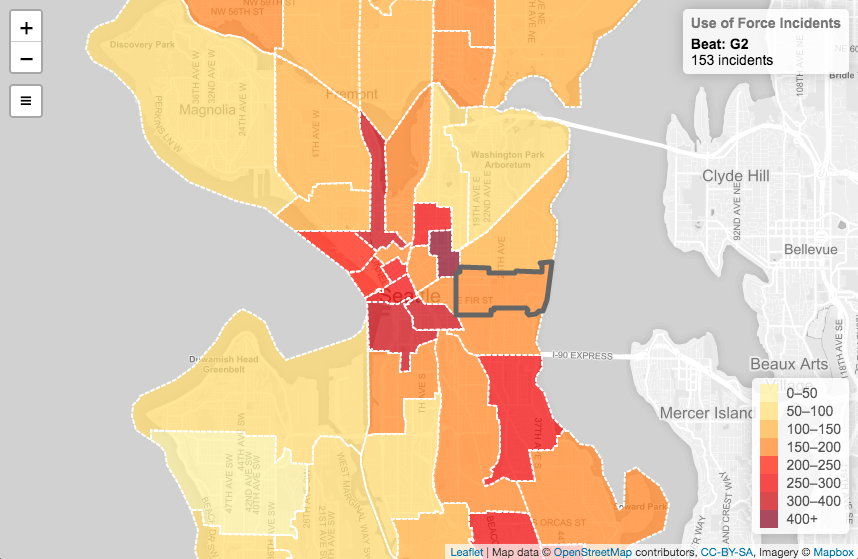
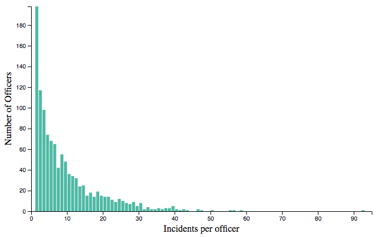

# Seattle Police Department use of force

Analysis of SPD use of force data provided through the Seattle Open Data Portal: [link](https://data.seattle.gov/Public-Safety/Use-Of-Force/ppi5-g2bj). The geospatial visualization includes all the data, which spans from January 2014 until now (October 2019). For the curious, all use of force incidents are graded according to these [SPD defintions](http://www.seattle.gov/police-manual/title-8---use-of-force/8050---use-of-force-definitions).

These data were merged with SPD [beat](https://en.wikipedia.org/wiki/Beat_(police)) geometries, converted to GeoJSON from the available KMZ geometries in the [open data portal](https://data.seattle.gov/Public-Safety/Seattle-Police-Department-Beats/nnxn-434b). For simplicity only 2018 beat geometries were used, this means some of the pre-2018 data lying on the beat boundaries may be misrepresented.

## Demo

TODO

## Screenshots




## Code layout

I am more comfortable in Python so all the data processing and file output code is handled in `parse.py`, otherwise there are two visualization in seperate html files.

The layout and purpose of the main files are as follows:
```
.
├── data                     # Static GeoJSON, JSON, and CSV data used for viz generation
├── force.[html,js,css]      # Map visualization and styling
├── histogram.[html,js,css]  # Incidents per officer visualization and styling
└── parse.py                 # Script for fetching, processing, and writing data files
```
